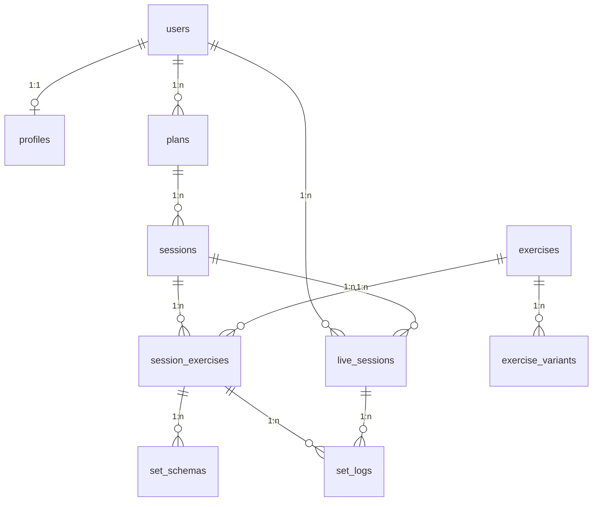

# Database Schema & Setup

## Overview
Die Trainr App nutzt Supabase PostgreSQL mit Row Level Security (RLS) für Datenschutz.

## Tabellen & Beziehungen

### Core Tables
- **profiles** - User-Profile (erweitert auth.users)
- **plans** - Trainingspläne (1:n zu sessions)
- **sessions** - Einzelne Trainingseinheiten (n:1 zu plans)
- **exercises** - Übungen (global + user-spezifisch)
- **exercise_variants** - Varianten von Übungen (n:1 zu exercises)
- **session_exercises** - Übungen in einer Session (n:1 zu sessions, n:1 zu exercises)
- **set_schemas** - Geplante Sätze (n:1 zu session_exercises)
- **live_sessions** - Aktive Trainingseinheiten (n:1 zu sessions)
- **set_logs** - Geloggte Sätze (n:1 zu live_sessions)

## RLS Policies (Stichpunkte)
- **User-basiert:** Jeder User sieht nur eigene Daten
- **Hierarchisch:** Sessions über Plans, Set-Logs über Live-Sessions
- **Global:** Exercises können global oder user-spezifisch sein
- **Cascade:** Löschungen respektieren Beziehungen

## ERD

## Setup
Führe `COMPLETE_DATABASE_FIX.sql` in Supabase SQL Editor aus:
1. Alle 9 Tabellen erstellen
2. RLS aktivieren
3. Policies setzen
4. Beziehungen etablieren

## Migration Status
- ✅ Schema definiert
- ❌ Tabellen in DB fehlen (PGRST205 Fehler)
- ✅ RLS Policies definiert
- ✅ Service Layer implementiert

