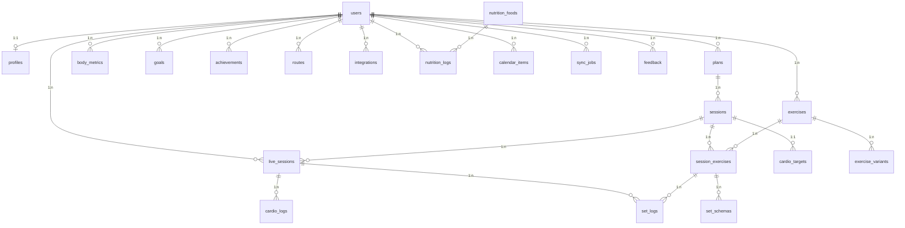

# Entity Relationship Diagram (ERD)

## Übersicht

Das Datenbankschema der Trainings-App ist für Skalierbarkeit und Performance optimiert. Alle Tabellen verwenden UUIDs als Primary Keys und haben Row Level Security (RLS) aktiviert.

## Schema Diagramm



## Tabellen-Details

### Core Tables

#### profiles
Erweitert die Supabase `auth.users` Tabelle um zusätzliche User-Daten.

```sql
CREATE TABLE profiles (
  user_id UUID PRIMARY KEY REFERENCES auth.users(id),
  display_name TEXT,
  gender TEXT CHECK (gender IN ('male', 'female', 'other')),
  birthdate DATE,
  unit_mass TEXT DEFAULT 'kg',
  unit_length TEXT DEFAULT 'cm', 
  level TEXT DEFAULT 'beginner',
  theme TEXT DEFAULT 'dark',
  locale TEXT DEFAULT 'de',
  created_at TIMESTAMPTZ DEFAULT NOW(),
  updated_at TIMESTAMPTZ DEFAULT NOW()
);
```

#### plans
Trainingspläne mit Metadaten und Archivierungs-Funktion.

```sql
CREATE TABLE plans (
  id UUID PRIMARY KEY DEFAULT gen_random_uuid(),
  user_id UUID NOT NULL REFERENCES auth.users(id),
  name TEXT NOT NULL,
  goal TEXT,
  active BOOLEAN DEFAULT true,
  archived_at TIMESTAMPTZ,
  created_at TIMESTAMPTZ DEFAULT NOW(),
  updated_at TIMESTAMPTZ DEFAULT NOW()
);
```

#### sessions
Einzelne Trainingseinheiten innerhalb eines Plans.

```sql
CREATE TABLE sessions (
  id UUID PRIMARY KEY DEFAULT gen_random_uuid(),
  plan_id UUID NOT NULL REFERENCES plans(id),
  type TEXT NOT NULL CHECK (type IN ('strength', 'cardio')),
  name TEXT NOT NULL,
  weekday INTEGER NOT NULL CHECK (weekday >= 0 AND weekday <= 6),
  time TIME,
  order_index INTEGER DEFAULT 0,
  created_at TIMESTAMPTZ DEFAULT NOW(),
  updated_at TIMESTAMPTZ DEFAULT NOW()
);
```

### Exercise System

#### exercises
Übungen können global (user_id = NULL) oder user-spezifisch sein.

```sql
CREATE TABLE exercises (
  id UUID PRIMARY KEY DEFAULT gen_random_uuid(),
  user_id UUID REFERENCES auth.users(id), -- NULL = global
  name TEXT NOT NULL,
  muscle_primary TEXT,
  muscle_secondary TEXT[],
  equipment TEXT[],
  favorite_variant TEXT,
  media_url TEXT,
  technique_notes TEXT,
  created_at TIMESTAMPTZ DEFAULT NOW(),
  updated_at TIMESTAMPTZ DEFAULT NOW()
);
```

#### exercise_variants
Varianten einer Übung (Barbell, Dumbbell, Machine, etc.).

```sql
CREATE TABLE exercise_variants (
  id UUID PRIMARY KEY DEFAULT gen_random_uuid(),
  exercise_id UUID NOT NULL REFERENCES exercises(id),
  variant TEXT NOT NULL CHECK (variant IN (
    'machine', 'barbell', 'dumbbell', 'cable', 
    'bodyweight', 'kettlebell', 'resistance_band'
  )),
  created_at TIMESTAMPTZ DEFAULT NOW()
);
```

#### session_exercises
Übungen die in einer Session ausgeführt werden.

```sql
CREATE TABLE session_exercises (
  id UUID PRIMARY KEY DEFAULT gen_random_uuid(),
  session_id UUID NOT NULL REFERENCES sessions(id),
  exercise_id UUID NOT NULL REFERENCES exercises(id),
  selected_variant TEXT,
  notes TEXT,
  order_index INTEGER DEFAULT 0,
  created_at TIMESTAMPTZ DEFAULT NOW(),
  updated_at TIMESTAMPTZ DEFAULT NOW()
);
```

### Training Execution

#### set_schemas
Geplante Sätze mit Gewicht, Reps und RPE/RIR.

```sql
CREATE TABLE set_schemas (
  id UUID PRIMARY KEY DEFAULT gen_random_uuid(),
  session_exercise_id UUID NOT NULL REFERENCES session_exercises(id),
  variant TEXT NOT NULL,
  set_index INTEGER NOT NULL,
  planned_reps INTEGER,
  planned_weight DECIMAL(5,2),
  rir_or_rpe INTEGER CHECK (rir_or_rpe >= 1 AND rir_or_rpe <= 10),
  created_at TIMESTAMPTZ DEFAULT NOW(),
  updated_at TIMESTAMPTZ DEFAULT NOW()
);
```

#### live_sessions
Aktive Trainingseinheiten mit Status-Tracking.

```sql
CREATE TABLE live_sessions (
  id UUID PRIMARY KEY DEFAULT gen_random_uuid(),
  user_id UUID NOT NULL REFERENCES auth.users(id),
  session_id UUID REFERENCES sessions(id),
  type TEXT NOT NULL CHECK (type IN ('strength', 'cardio')),
  started_at TIMESTAMPTZ DEFAULT NOW(),
  finished_at TIMESTAMPTZ,
  duration_sec INTEGER,
  status TEXT DEFAULT 'active' CHECK (status IN ('active', 'completed', 'aborted'))
);
```

#### set_logs
Tatsächlich ausgeführte Sätze mit Auto-Progression-Flag.

```sql
CREATE TABLE set_logs (
  id UUID PRIMARY KEY DEFAULT gen_random_uuid(),
  live_session_id UUID NOT NULL REFERENCES live_sessions(id),
  session_exercise_id UUID NOT NULL REFERENCES session_exercises(id),
  variant TEXT NOT NULL,
  set_index INTEGER NOT NULL,
  actual_reps INTEGER,
  actual_weight DECIMAL(5,2),
  rpe INTEGER CHECK (rpe >= 1 AND rpe <= 10),
  notes TEXT,
  auto_progression_applied BOOLEAN DEFAULT false,
  created_at TIMESTAMPTZ DEFAULT NOW()
);
```

### Cardio & Routes

#### cardio_targets
Ziele für Cardio-Sessions (Zeit, Distanz, HR-Zone).

```sql
CREATE TABLE cardio_targets (
  id UUID PRIMARY KEY DEFAULT gen_random_uuid(),
  session_id UUID NOT NULL REFERENCES sessions(id),
  discipline TEXT NOT NULL CHECK (discipline IN (
    'running', 'cycling', 'swimming', 'rowing', 'walking', 'hiking'
  )),
  planned_duration_sec INTEGER,
  planned_distance_m INTEGER,
  planned_hr_zone INTEGER,
  created_at TIMESTAMPTZ DEFAULT NOW()
);
```

#### cardio_logs
Tatsächliche Cardio-Performance.

```sql
CREATE TABLE cardio_logs (
  id UUID PRIMARY KEY DEFAULT gen_random_uuid(),
  live_session_id UUID NOT NULL REFERENCES live_sessions(id),
  distance_m INTEGER,
  duration_sec INTEGER,
  avg_hr INTEGER,
  avg_pace DECIMAL(5,2),
  calories INTEGER,
  created_at TIMESTAMPTZ DEFAULT NOW()
);
```

#### routes
GPS-Routen mit GeoJSON-Daten.

```sql
CREATE TABLE routes (
  id UUID PRIMARY KEY DEFAULT gen_random_uuid(),
  user_id UUID NOT NULL REFERENCES auth.users(id),
  name TEXT NOT NULL,
  surface TEXT,
  distance_m INTEGER,
  climb_m INTEGER,
  map_geojson JSONB,
  gpx_url TEXT,
  created_at TIMESTAMPTZ DEFAULT NOW(),
  updated_at TIMESTAMPTZ DEFAULT NOW()
);
```

### Analytics & Progression

#### body_metrics
Körpermaße und Gewicht-Tracking.

```sql
CREATE TABLE body_metrics (
  id UUID PRIMARY KEY DEFAULT gen_random_uuid(),
  user_id UUID NOT NULL REFERENCES auth.users(id),
  date DATE NOT NULL,
  weight_kg DECIMAL(5,2),
  body_fat_pct DECIMAL(4,2),
  chest_cm INTEGER,
  biceps_cm INTEGER,
  waist_cm INTEGER,
  hip_cm INTEGER,
  thigh_cm INTEGER,
  calf_cm INTEGER,
  created_at TIMESTAMPTZ DEFAULT NOW(),
  updated_at TIMESTAMPTZ DEFAULT NOW()
);
```

#### goals
Trainingsziele mit Fortschritts-Tracking.

```sql
CREATE TABLE goals (
  id UUID PRIMARY KEY DEFAULT gen_random_uuid(),
  user_id UUID NOT NULL REFERENCES auth.users(id),
  type TEXT NOT NULL,
  target_value DECIMAL(10,2),
  due_date DATE,
  status TEXT DEFAULT 'active' CHECK (status IN (
    'active', 'completed', 'paused', 'cancelled'
  )),
  progress_value DECIMAL(10,2) DEFAULT 0,
  created_at TIMESTAMPTZ DEFAULT NOW(),
  updated_at TIMESTAMPTZ DEFAULT NOW()
);
```

#### achievements
Erfolge und Badges.

```sql
CREATE TABLE achievements (
  id UUID PRIMARY KEY DEFAULT gen_random_uuid(),
  user_id UUID NOT NULL REFERENCES auth.users(id),
  key TEXT NOT NULL,
  title TEXT NOT NULL,
  description TEXT,
  unlocked_at TIMESTAMPTZ DEFAULT NOW(),
  created_at TIMESTAMPTZ DEFAULT NOW()
);
```

#### progression_cycles
Auto-Progression Regeln.

```sql
CREATE TABLE progression_cycles (
  id UUID PRIMARY KEY DEFAULT gen_random_uuid(),
  user_id UUID NOT NULL REFERENCES auth.users(id),
  name TEXT NOT NULL,
  strategy TEXT NOT NULL,
  period_days INTEGER DEFAULT 7,
  increment_value DECIMAL(5,2),
  increment_unit TEXT CHECK (increment_unit IN ('kg', '%', 'rep')),
  deload_rule TEXT,
  created_at TIMESTAMPTZ DEFAULT NOW(),
  updated_at TIMESTAMPTZ DEFAULT NOW()
);
```

### Integration & Nutrition

#### integrations
OAuth-Tokens für externe Services.

```sql
CREATE TABLE integrations (
  id UUID PRIMARY KEY DEFAULT gen_random_uuid(),
  user_id UUID NOT NULL REFERENCES auth.users(id),
  provider TEXT NOT NULL CHECK (provider IN (
    'garmin', 'strava', 'apple_health', 'google_fit', 'yazio'
  )),
  access_token TEXT, -- encrypted
  refresh_token TEXT, -- encrypted
  expires_at TIMESTAMPTZ,
  scopes TEXT[],
  created_at TIMESTAMPTZ DEFAULT NOW(),
  updated_at TIMESTAMPTZ DEFAULT NOW()
);
```

#### nutrition_foods
Lebensmittel-Datenbank.

```sql
CREATE TABLE nutrition_foods (
  id UUID PRIMARY KEY DEFAULT gen_random_uuid(),
  name TEXT NOT NULL,
  source TEXT CHECK (source IN ('usda', 'yazio', 'custom')),
  kcal DECIMAL(8,2),
  protein DECIMAL(8,2),
  carbs DECIMAL(8,2),
  fat DECIMAL(8,2),
  unit TEXT,
  portion_grams DECIMAL(8,2),
  created_at TIMESTAMPTZ DEFAULT NOW(),
  updated_at TIMESTAMPTZ DEFAULT NOW()
);
```

#### nutrition_logs
Ernährungs-Tracking.

```sql
CREATE TABLE nutrition_logs (
  id UUID PRIMARY KEY DEFAULT gen_random_uuid(),
  user_id UUID NOT NULL REFERENCES auth.users(id),
  date DATE NOT NULL,
  items JSONB, -- [{food_id, qty, grams, kcal, protein, carbs, fat}]
  notes TEXT,
  created_at TIMESTAMPTZ DEFAULT NOW(),
  updated_at TIMESTAMPTZ DEFAULT NOW()
);
```

### System Tables

#### calendar_items
Kalender-Integration und ICS-Export.

```sql
CREATE TABLE calendar_items (
  id UUID PRIMARY KEY DEFAULT gen_random_uuid(),
  user_id UUID NOT NULL REFERENCES auth.users(id),
  title TEXT NOT NULL,
  type TEXT CHECK (type IN ('session', 'event')),
  start_ts TIMESTAMPTZ NOT NULL,
  end_ts TIMESTAMPTZ,
  session_id UUID REFERENCES sessions(id),
  external_id TEXT,
  created_at TIMESTAMPTZ DEFAULT NOW(),
  updated_at TIMESTAMPTZ DEFAULT NOW()
);
```

#### sync_jobs
Hintergrund-Sync-Jobs für Integrationen.

```sql
CREATE TABLE sync_jobs (
  id UUID PRIMARY KEY DEFAULT gen_random_uuid(),
  user_id UUID NOT NULL REFERENCES auth.users(id),
  provider TEXT NOT NULL,
  status TEXT DEFAULT 'pending' CHECK (status IN (
    'pending', 'running', 'completed', 'failed'
  )),
  payload JSONB,
  created_at TIMESTAMPTZ DEFAULT NOW(),
  finished_at TIMESTAMPTZ
);
```

#### feedback
User-Feedback und Support.

```sql
CREATE TABLE feedback (
  id UUID PRIMARY KEY DEFAULT gen_random_uuid(),
  user_id UUID REFERENCES auth.users(id),
  message TEXT NOT NULL,
  email TEXT,
  created_at TIMESTAMPTZ DEFAULT NOW(),
  handled BOOLEAN DEFAULT false
);
```

## Indizes

### Performance-Indizes
```sql
-- User-basierte Indizes
CREATE INDEX idx_plans_user_id ON plans(user_id);
CREATE INDEX idx_sessions_plan_id ON sessions(plan_id);
CREATE INDEX idx_exercises_user_id ON exercises(user_id);
CREATE INDEX idx_live_sessions_user_id ON live_sessions(user_id);
CREATE INDEX idx_set_logs_live_session_id ON set_logs(live_session_id);
CREATE INDEX idx_body_metrics_user_id_date ON body_metrics(user_id, date);
CREATE INDEX idx_nutrition_logs_user_id_date ON nutrition_logs(user_id, date);
CREATE INDEX idx_calendar_items_user_id_start ON calendar_items(user_id, start_ts);
```

## Row Level Security (RLS)

Alle Tabellen haben RLS aktiviert mit Policies, die sicherstellen:

- **User Isolation**: Jeder User kann nur seine eigenen Daten sehen/bearbeiten
- **Global Access**: Globale Übungen sind für alle sichtbar
- **Feedback**: Jeder kann Feedback einreichen, aber nur eigene einsehen

### Beispiel RLS Policy
```sql
-- Plans Policy
CREATE POLICY "Users can view own plans" ON plans
  FOR SELECT USING (auth.uid() = user_id);

CREATE POLICY "Users can insert own plans" ON plans
  FOR INSERT WITH CHECK (auth.uid() = user_id);
```

## Materialized Views (Geplant)

### muscle_volume_agg
Aggregierte Muskelgruppen-Volumen für Analytics.

```sql
CREATE MATERIALIZED VIEW muscle_volume_agg AS
SELECT 
  user_id,
  muscle_group,
  DATE_TRUNC('week', created_at) as week,
  SUM(actual_reps * actual_weight) as total_volume,
  COUNT(*) as exercise_count
FROM set_logs sl
JOIN session_exercises se ON se.id = sl.session_exercise_id
JOIN exercises e ON e.id = se.exercise_id
WHERE sl.created_at >= NOW() - INTERVAL '12 weeks'
GROUP BY user_id, muscle_group, week;
```

## Migration Strategy

### Versioning
- Migrationen sind numeriert: `001_initial_schema.sql`, `002_rls_policies.sql`
- Seeds sind getrennt: `demo_data.sql`
- Rollback-Strategien für Production-Deployments

### Backup
- Tägliche automatische Backups über Supabase
- Point-in-time Recovery für kritische Daten
- Export-Funktionen für User-Daten (GDPR)

## Skalierung

### Partitioning (Geplant)
- `set_logs` nach Datum partitionieren
- `nutrition_logs` nach User und Datum
- `calendar_items` nach User und Jahr

### Read Replicas
- Separate Read-Replicas für Analytics-Queries
- Caching für häufige Abfragen (Übungen, Pläne)
